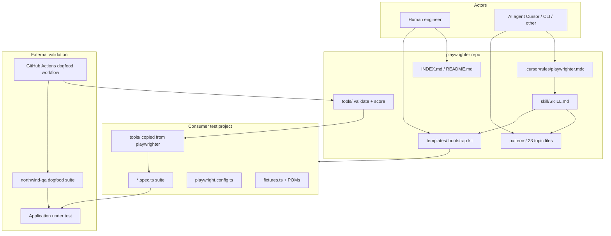
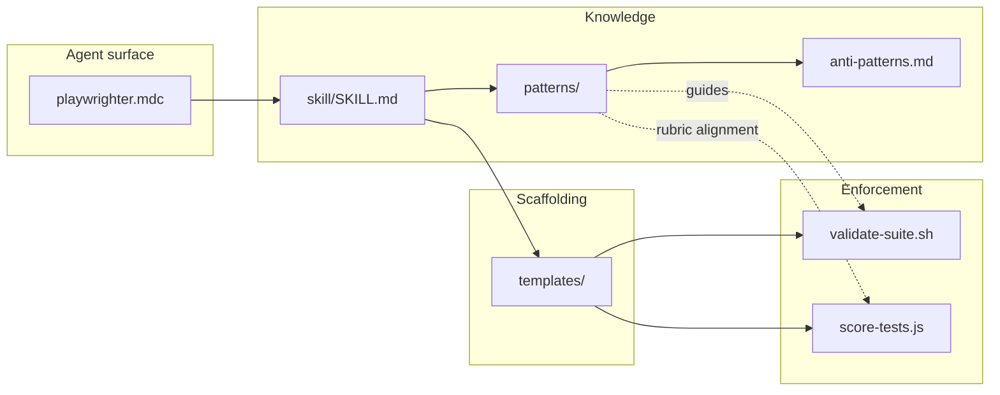
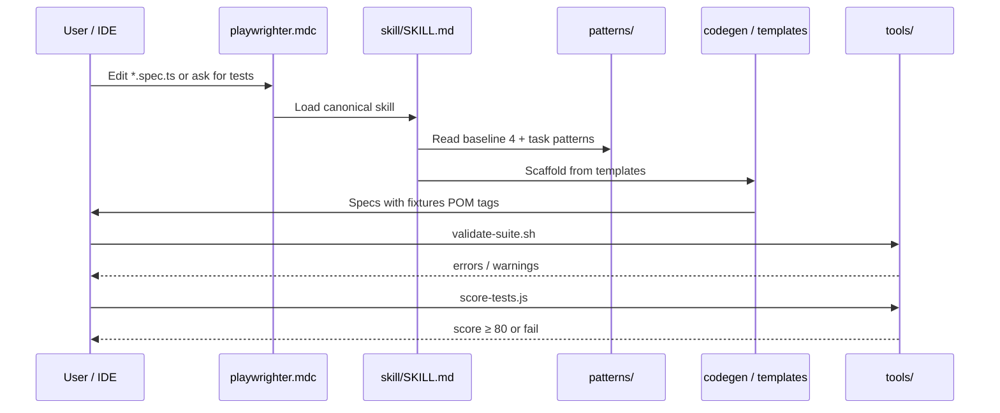
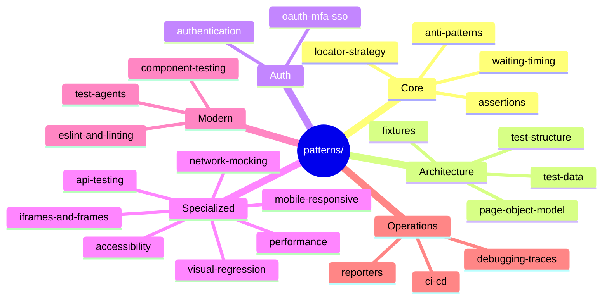
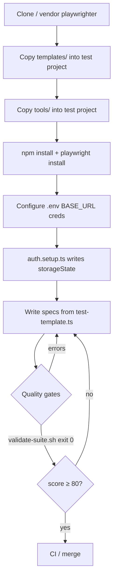
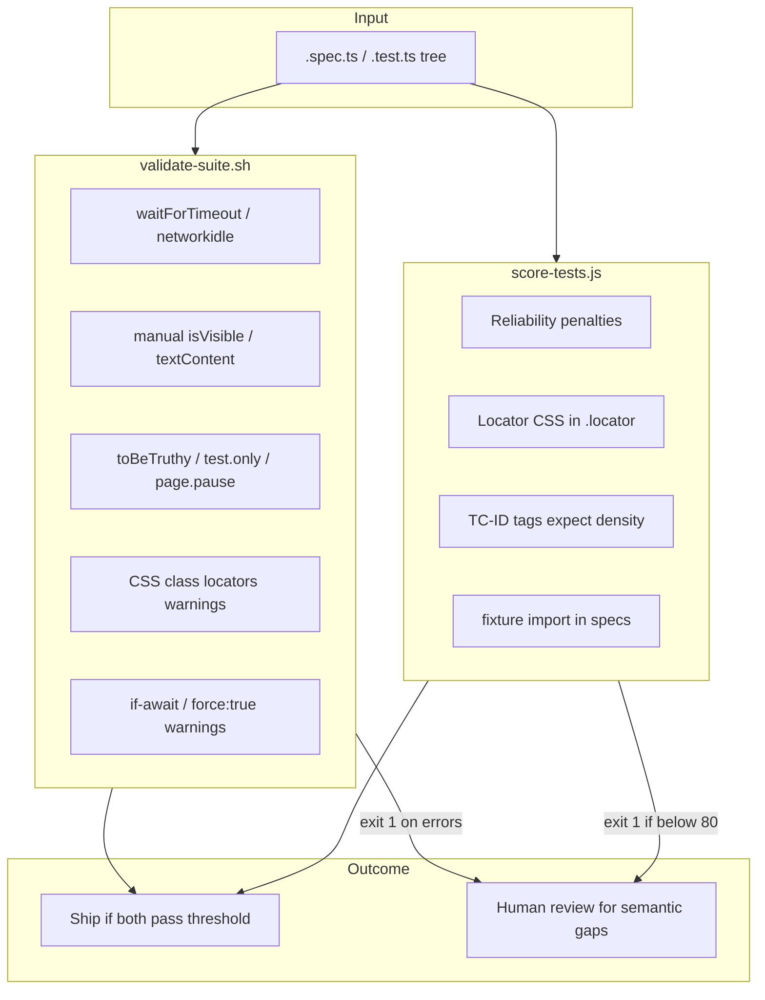
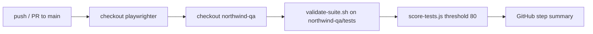
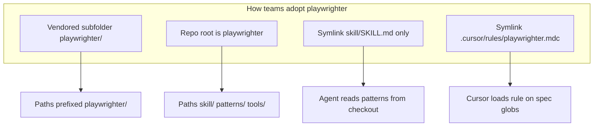

# playwrighter architecture

playwrighter is a **documentation + scaffolding + lint/score harness** for Playwright E2E suites. It does not run application tests inside this repo; it teaches patterns, ships copy-paste templates, and enforces a syntactic quality bar on `.spec.ts` trees in consumer projects (and on the external [northwind-qa](https://github.com/weijia-89/northwind-qa) dogfood suite in CI).

---

## System context



---

## In-repo layers

| Layer | Path | Role |
|-------|------|------|
| **Agent entry** | `.cursor/rules/playwrighter.mdc` | Cursor rule: globs, invariants, points at canonical skill |
| **Canonical skill** | `skill/SKILL.md` | Single source of truth for agents; workflow, pattern index, output contract |
| **Patterns** | `patterns/*.md` | Deep guidance (23 files); not all rules are machine-enforced |
| **Templates** | `templates/` | Starter config, fixtures, POMs, `package.json`, `scripts/check-tools.js` |
| **Tools** | `tools/validate-suite.sh`, `tools/score-tests.js` | Grep-based linter + 100-point scorecard (inline rubric in JS) |
| **Human entry** | `README.md`, `INDEX.md`, `GETTING_STARTED.md` | Onboarding and topic map |
| **CI contract** | `.github/workflows/dogfood-northwind-qa.yml` | Lint + score external northwind-qa on every main PR |
| **SDK automation** | `scripts/cursor-sdk/` | Optional `Agent.prompt` runners (harness fixes, arch regen) |



---

## Agent workflow (write tests)



**Mandatory pattern reads** (any task): `locator-strategy`, `waiting-timing`, `assertions`, `anti-patterns`, plus task-specific files listed in `skill/SKILL.md`.

**Output contract** (spec files): `./fixtures` imports, `[TC-XXX]`, `@P0`/`@smoke` tags, web-first `expect`, accessible locators.

---

## Pattern taxonomy (23 files)



---

## Consumer bootstrap



`templates/scripts/check-tools.js` fails fast if `tools/` was not copied before `npm run validate` / `score`.

---

## Enforcement pipeline

Not every row in `anti-patterns.md` is automated. Two tools split responsibility:



| Check | validate-suite | score-tests |
|-------|----------------|-------------|
| `waitForTimeout` | Error | −10 |
| `networkidle` | Error | −10 |
| `expect(await …isVisible())` | Error | −5 |
| `test.only` / `page.pause` | Error | −3 / −5 |
| `if (await …)` | Warning | −3 |
| `{ force: true }` | Warning | −2 |
| Missing `[TC-XXX]` | — | up to −10 |
| `@playwright/test` in spec | — | −5 |
| CSS in `.locator('.#…')` | Warning | −2 each cap 10 |

---

## CI dogfood (this repo)



playwrighter has **no in-repo `.spec.ts` dogfood**; the contract suite lives in `weijia-89/northwind-qa`.

---

## Integration modes



---

## Regenerating this document

```bash
cd scripts/cursor-sdk
export CURSOR_API_KEY=...
npm run generate-arch
```

Or edit `ARCH.MD` by hand; keep diagrams aligned with `skill/SKILL.md` and `tools/score-tests.js` rubric comments.
